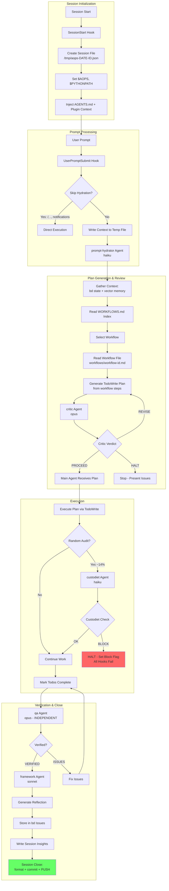

# academicOps: A constitutional automation framework for academic work

* Enforces a logical system: every rule derivable from AXIOMS.md with HEURISTICS.md supported by evidence.
* Reflexive, self-improving agents must follow a CATEGORICAL IMPERATIVE: every action must be supported by a general rule.
* Graduated approach to enforcement: enforcement-map.md sets out a full map of rules to enforcement mechanism, from gentle reminders to hard blocks.
* Agent autonomy is limited to the authority they were granted: live ultra vires detection loop
* Direct integration with beads for task memomory, memory mcp for vector search
* Full personal knowledge base with gardening and continuous remembering skills
* Human readable and portable Markdown files are the single sources of truth 
* Everything in git for durability and observability
* Strict separation of user data (not in this repo)
* Optimised for long-term strategic planning under conditions of uncertainty
* Includes integrated MCP tooling for email and calendar access


## Installation

### Link your data repository / knowledge base

- **Environment variables** in `~/.bashrc` or `~/.zshrc`:
```bash
export ACA_DATA="$HOME/writing/data"     # Your data (NOT in git)
```

### Install plugin for Claude Code & Gemini CLI

Distribution repository: https://github.com/nicsuzor/aops-dist

Claude Code

```bash
command claude plugin marketplace add nicsuzor/aops-dist
command claude plugin marketplace update aops
command claude plugin install aops-core@aops
```

Gemini CLI (warning: auto accept flag below, remove --consent if you're concerned)
```bash
command gemini extensions install git@github.com:nicsuzor/aops-dist.git --consent --auto-update --pre-release 
```

## Core Loop

**For detailed specification, see**: [[aops-core/specs/flow.md]]

**Goal**: The minimal viable framework with ONE complete, working loop.

**Philosophy**: Users don't have to use aops. But if they do, it's slow and thorough. The full workflow is MANDATORY.

### Core Loop Diagram



## Core Concepts

### The Logical Derivation System

academicOps is built as a **validated logical system**. Every rule traces back to first principles:

| Level | Document | Contains | Status |
|-------|----------|----------|--------|
| 1 | **AXIOMS.md** | Inviolable principles | Cannot be violated |
| 2 | **HEURISTICS.md** | Empirically validated rules | Can be revised with evidence |
| 3 | **enforcement-map.md** | Enforcement mechanisms | Maps rules to technical controls |

**The derivation rule**: Every convention MUST trace to an axiom. If it can't be derived, the convention is invalid.

### Axioms vs Heuristics

**Axioms** are inviolable—they define what the system IS:
- "Fail-Fast": No defaults, no fallbacks, no silent failures
- "Skills Are Read-Only": No dynamic data in skills
- "Research Data Is Immutable": Never modify source datasets

**Heuristics** are working hypotheses validated by evidence:
- "Semantic Link Density": Related files MUST link to each other
- "Skills Contain No Dynamic Content": Current state lives in $ACA_DATA

The difference: axioms cannot be violated; heuristics can and _should be_ be revised when evidence shows they're wrong.

### Skills vs Workflows

The framework distinguishes between **what** to do and **how** to do it:

| | Skills | Workflows |
|---|--------|-----------|
| **Answer** | "How do I do X?" | "What should I do?" |
| **Nature** | Fungible instructions | Composable chains of steps |
| **Examples** | Create a PDF, generate a mindmap | Feature development, TDD cycle |

**Skills** are interchangeable recipes—any skill that creates a PDF can substitute for another. They're the building blocks.

**Workflows** orchestrate those building blocks into coherent processes. A workflow defines the sequence (spec review → implementation → QA), while skills handle each step's mechanics.

For full specification, see [[aops-core/specs/workflow-system-spec]].

### Enforcement Levels

Rules aren't just documented—they're enforced at multiple levels:

| Level | Mechanism | Example |
|-------|-----------|---------|
| **Hard Gate** | Blocks action entirely | PreToolUse hooks block `git reset --hard` |
| **Soft Gate** | Injects guidance, agent can proceed | prompt-hydrator suggests skills |
| **Prompt** | Instructional (AXIOMS.md at session start) | "Verify First" reminder |
| **Detection** | Logs for analysis | custodiet compliance checks |
| **Pre-commit** | Blocks commits | Orphan file detection |

### The Self-Reflexive Framework Agent

This framework treats itself as a hypothesis. Agents are **co-developers**, not just executors:

```
When you encounter friction—something that doesn't fit, a question
the schema can't answer, a pattern that needs a name—do this:

1. Log it.
2. Propose an amendment if you see one.
3. Don't force it. If something doesn't fit, that's data.
```

The framework **evolves through use**. When agents hit friction:
- Violations are logged as bd issues (operational observations)
- Patterns that emerge get named and proposed as new heuristics
- Heuristics that prove themselves get promoted or consolidated
- Rules that don't work get revised

This creates a feedback loop: the framework improves based on real usage, not theoretical design.

### How the Framework Improves Itself

The self-improvement cycle has three phases:

**1. Observe** - Every session generates observables:
- **Framework Reflections**: Agent self-reports at session end (outcome, friction, proposals)
- **Token metrics**: Usage by model, agent, and tool (cache efficiency, throughput)
- **Skill compliance**: Which suggested skills were actually invoked
- **Learning observations**: Mistakes and corrections with root cause categories

See [[specs/framework-observability]] for details

**2. Analyze** - Humans identify patterns:
- Recurring friction points → systemic problems
- Low skill compliance → discovery or routing issues
- Token inefficiency → optimize hydration or caching

**3. Intervene** - Apply graduated fixes via `/learn`:
- Start at lowest effective level (corollary, then heuristic, then hook)
- Document root cause and intervention in a task
- Verify improvement in subsequent sessions

See [[specs/feedback-loops]] for the complete improvement workflow.

### Memory Architecture

The framework distinguishes between two types of knowledge:

| Type | Storage | Example |
|------|---------|---------|
| **Episodic** | task+git issues | "I tried X and it failed" (time-stamped observations) |
| **Semantic** | $ACA_DATA markdown | "X doesn't work because Y" (timeless truths) |

$ACA_DATA is a **current state machine**—always up to date, always perfect. The memory server (accessed via `mcp__memory__retrieve_memory`) is a semantic search index derived from this markdown.

## Architecture

### Core Components

| Category    | Components                                                                               |
| ----------- | ---------------------------------------------------------------------------------------- |
| Skills (6)  | remember, framework, audit, session-insights, garden, hypervisor                         |
| Agents (5)  | prompt-hydrator, critic, custodiet, qa, framework                                        |
| Hooks (13)  | router.py (dispatcher), unified_logger.py, user_prompt_submit.py, session_env_setup.sh, hydration_gate.py, task_required_gate.py, policy_enforcer.py, overdue_enforcement.py, fail_fast_watchdog.py, custodiet_gate.py, task_binding.py, memory_sync_closed_issues.py, reflection_check.py, session_end_commit_check.py |
| Governance  | 7 enforced axioms, 4 enforced heuristics (with mechanical checks)                        |

### Key Agents

| Agent | Model | Role |
|-------|-------|------|
| **framework** | opus | Primary entry point for framework changes. Handles full task lifecycle. |
| **prompt-hydrator** | haiku | Enriches prompts with context, suggests workflows, applies guardrails |
| **critic** | opus | Reviews plans for errors and hidden assumptions before execution |
| **custodiet** | haiku | Periodic compliance audits (~14% of tool calls). Detects drift. |
| **qa** | opus | Independent verification that acceptance criteria are met |

The **framework agent** embodies the self-reflexive principle—it both executes framework tasks AND proposes improvements to the framework itself.

## Commands

| Command              | Purpose                                                                                      |
| -------------------- | -------------------------------------------------------------------------------------------- |
| /aops                | Show framework capabilities                                                                  |
| /audit-framework     | Comprehensive framework governance audit                                                     |
| /diag                | Quick diagnostic of what's loaded in session                                                 |
| /email               | Extract action items from emails → tasks                                                     |
| /learn               | Make minimal framework tweaks with tracking                                                  |
| /log                 | Log agent patterns to thematic learning files                                                |
| /meta                | Strategic brain + executor for framework work                                                |
| /pull                | Get and run a task from the queue                                                            |
| /q                   | Queue task for later (→ bd issues)                                                           |
| /qa                  | Verify outcomes against acceptance criteria                                                  |
| /reflect             | Self-audit process compliance; see also `/session-insights current` for automated reflection |
| /remind              | Queue agent work for later (→ bd issues)                                                     |
| /review-training-cmd | Process review/source pair for training data                                                 |
| /strategy            | Strategic thinking partner (no execution)                                                    |
| /task-next           | Get 2-3 task recommendations (should/enjoy/quick)                                            |
| /task-viz            | Task graph visualization (Excalidraw)                                                        |
| /ttd                 | TDD workflow (alias for /supervise tdd)                                                      |
| /work                | Collaborative task execution (human-led)                                                     |

