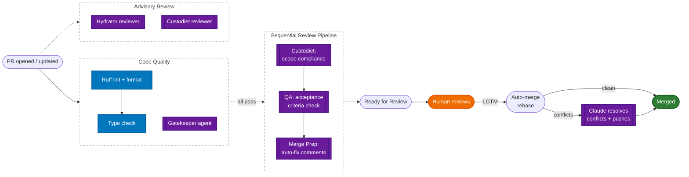

# academicOps

A constitutional framework for governing autonomous AI agents with:

1. **_Ultra vires_ detection** ensures that agents operate within zones of autonomy bounded by their grant of authority -- using public law theory to identify when discretionary choices become invalid.

2. **A constitutional hierarchy of norms** (axioms → heuristics → enforcement rules) requires every operational rule to derive from a first principle, preventing governance bloat through the same derivation logic that constrains delegated legislation.

3. **Commons-based peer review** applies the **bazaar** model of F/OSS peer production to AI governance. Instead of ex-ante rules, we encourage experimentation and collaborative work. Agents review each other's work through structured PR pipelines, the way open source maintainers govern contributions from autonomous participants at scale.

4. **Doctrinal development** through structured session reflections means recurring friction gets named, codified, and promoted or demoted based on evidence -- the rule system grows incrementally, the way case law does.

5. **Domain-specific academic tools** -- citation management (Zotero), research data analysis (dbt, Streamlit), document conversion, email triage, writing style enforcement.

## The distributed review pipeline



- **By the time the human sees the PR, everything should be clean.** Gatekeeper approves alignment (Approval #1), then custodiet, QA, and merge-prep run sequentially. Merge-prep auto-fixes review comments and pushes corrections.
- Only humans can trigger merges. "LGTM" means **merge now** — it lodges Approval #2 and enables auto-merge (rebase). If merge conflicts exist, `@claude` is invoked to rebase and resolve them.
- Hydrator and custodiet reviewers post non-blocking advisory comments on PR creation.
- Full process documentation: [`specs/pr-process.md`](specs/pr-process.md).

## Local session lifecycle

Every mutating operation passes through gates: active task (work tracking), hydrated execution plan (intent verification), periodic compliance audits (drift detection). Sessions end with structured reflection.

## Hierarchy of norms

| Level | Document | Role | Analogy |
| ----- | -------- | ---- | ------- |
| 1 | **AXIOMS.md** | Inviolable principles (30+) | Constitutional provisions |
| 2 | **HEURISTICS.md** | Evidence-based working rules (40+) | Common law doctrine |
| 3 | **enforcement-map.md** | Rule-to-mechanism mapping | Regulatory implementation |

Axioms are inviolable: "Fail-Fast" means no defaults, no silent failures; "Research Data Is Immutable" means source datasets are sacred. Heuristics are working hypotheses that evolve through use — "Subagent Verdicts Are Binding" emerged after an agent ignored a compliance finding and introduced scope drift. New rules must derive from existing axioms; if they can't, either the rule is wrong or the axiom set is incomplete.

## Graduated enforcement

| Level | Mechanism | Example |
| ----- | --------- | ------- |
| **Hard gate** | Blocks action | Task binding for destructive ops |
| **Soft gate** | Injects guidance | Hydrator suggests workflows |
| **Periodic audit** | Every ~15 ops | Custodiet detects drift |
| **Pre-commit** | Blocks commits | Orphan files, frontmatter validation |
| **Prompt-level** | JIT injection | Relevant principles surfaced in context |

## Feedback loop

The framework treats itself as a hypothesis under continuous test. Every session generates structured reflections and compliance data. Recurring friction gets named as doctrine. The `/learn` skill captures failures as structured knowledge, with fixes applied at the lowest effective level.

## Memory architecture

| Type | Storage | Example |
| ---- | ------- | ------- |
| **Semantic** | `$ACA_DATA` markdown | Timeless knowledge |
| **Episodic** | Task graph + git issues | Session observations |

`$ACA_DATA` is a current state machine. Human-readable markdown in git, with a memory server providing semantic search over vector embeddings.

## Agent architecture

| Agent | Role |
| ----- | ---- |
| **prompt-hydrator** | Enriches prompts with context, selects workflows, applies guardrails |
| **custodiet** | Live compliance audits — drift, violations, scope creep |
| **critic** | Reviews execution plans for errors and hidden assumptions |
| **qa** | Independent verification against acceptance criteria |
| **effectual-planner** | Strategic planning under genuine uncertainty |

## Skills and commands

24 skills, 7 commands. Skills are fungible. Key examples:

| | |
| --- | --- |
| `/analyst` | Research data analysis (dbt, Streamlit, stats) |
| `/strategy` | Strategic thinking under uncertainty |
| `/swarm-supervisor` | Parallel worker orchestration with isolated worktrees |
| `/hdr` | Higher degree research supervision workflows |
| `/remember` | Dual-write to markdown + memory server |
| `/learn` | Capture failures as structured knowledge |
| `/pull` `/q` `/dump` | Task queue lifecycle |

## Installation

Distribution repository: https://github.com/nicsuzor/aops-dist

Set the data directory environment variable in `~/.bashrc` or `~/.zshrc`:

```bash
export ACA_DATA="$HOME/brain"     # Your knowledge base (NOT in this repo)
```

Claude Code:

```bash
command claude plugin marketplace add nicsuzor/aops-dist
command claude plugin marketplace update aops && command claude plugin install aops-core@aops && command claude plugin list
```

Gemini CLI:

```bash
(command gemini extensions uninstall aops-core || echo not installed) && command gemini extensions install git@github.com:nicsuzor/aops-dist.git --consent --auto-update --pre-release
```

## Project configuration

Projects customise the framework by adding files to a `.agent/` directory:

- **`.agent/rules/`** - Project-specific rules loaded automatically as binding constraints
- **`.agent/workflows/`** - Project-specific workflows supplementing the global index
- **`.agent/context-map.json`** - Maps project documentation to topics for just-in-time context injection
