# academicOps

A constitutional framework for governing autonomous AI agents with:

1. **_Ultra vires_ detection** ensures that agents operate within zones of autonomy bounded by their grant of authority -- using public law theory to identify when discretionary choices become invalid.

2. **A constitutional hierarchy of norms** (axioms → heuristics → enforcement rules) requires every operational rule to derive from a first principle, preventing governance bloat through the same derivation logic that constrains delegated legislation.

3. **Commons-based peer review** applies the **bazaar** model of F/OSS peer production to AI governance. Instead of ex-ante rules, we encourage experimentation and collaborative work. Agents review each other's work through structured PR pipelines, the way open source maintainers govern contributions from autonomous participants at scale.

4. **Reflective continuous improvemnt** through structured session summaries and explicit transcript analysis means recurring friction gets named, codified, and promoted or demoted based on evidence -- and rules evolve incrementally like common law.

5. **Domain-specific academic tools** -- citation management (Zotero), research data analysis (dbt, Streamlit), document conversion, email triage, writing style enforcement.

## The distributed review pipeline

```mermaid
flowchart LR
    PR([PR opened]) --> CQ

    subgraph CQ [Phase 1: Cheap Gate]
        Lint[Ruff lint + format]
        Gate[[Gatekeeper]]
        Types[Type check]
        Tests[Pytest]
        MPGate[Merge Prep: pending]
    end

    CQ --> Bazaar

    subgraph Bazaar [Phase 2: Bazaar Window]
        direction TB
        Gemini([Gemini Code Assist])
        Copilot([GitHub Copilot])
        Others([Other reviewers])
    end

    Bazaar --> Human([Phase 3: Human reviews])

    Human -- "LGTM<br/>(± instructions)" --> Cron

    subgraph Cron [Phase 4: Merge Prep]
        MP[[Merge Prep:<br/>critical review +<br/>cleanup of ALL feedback]]
    end

    Cron --> AutoMerge([Phase 5: Auto-merge<br/>GitHub native])

    classDef agent fill:#6a1b9a,stroke:#4a148c,stroke-width:2px,color:#fff
    classDef action fill:#0277bd,stroke:#01579b,stroke-width:2px,color:#fff
    classDef human fill:#ef6c00,stroke:#e65100,stroke-width:2px,color:#fff
    classDef success fill:#2e7d32,stroke:#1b5e20,stroke-width:2px,color:#fff
    classDef bazaar fill:#37474f,stroke:#263238,stroke-width:1px,color:#fff

    class Gate,MP agent
    class Lint,Types,Tests,MPGate action
    class Human human
    class AutoMerge success
    class Gemini,Copilot,Others bazaar

    style CQ fill:none,stroke:#888,stroke-dasharray: 5 5
    style Bazaar fill:none,stroke:#888,stroke-dasharray: 5 5
    style Cron fill:none,stroke:#888,stroke-dasharray: 5 5
```



- **Bazaar model**: all external reviews (Gemini, Copilot, humans) are embraced as first-class feedback. The pipeline gets maximum value from them without being reliant on them.
- **Cheap checks run on every push** (lint, typecheck, tests, gatekeeper). Expensive LLM review runs once, at the right time.
- **One human action**: the human says "lgtm" (optionally with specific instructions like "fix the docstring on line 42"). Merge Prep handles the rest — no second approval needed.
- **Cron-based merge-prep** (every 15 min) eliminates bot cascade loops. A 30-minute bazaar window gives external reviewers time to contribute before merge-prep processes all feedback.
- **GitHub-native enforcement**: required status checks (Lint, Gatekeeper, Type Check, Pytest, Merge Prep) and required reviews (1 human) handle merge gating. No custom state machines.
- Full process documentation: [`specs/pr-process.md`](specs/pr-process.md).

## Local session lifecycle

Every mutating operation passes through gates: active task (work tracking), hydrated execution plan (intent verification), periodic compliance audits (drift detection). Sessions end with structured reflection.

## Hierarchy of norms

| Level | Document | Role | Analogy |
| ----- | -------- | ---- | ------- |
| 1 | **AXIOMS.md** | Inviolable principles (30+) | Constitutional provisions |
| 2 | **HEURISTICS.md** | Evidence-based working rules (40+) | Common law doctrine |
| 3 | **enforcement-map.md** | Rule-to-mechanism mapping | Regulatory implementation |

Axioms are inviolable: "Fail-Fast" means no defaults, no silent failures; "Research Data Is Immutable" means source datasets are sacred. Heuristics are working hypotheses that evolve through use — "Subagent Verdicts Are Binding" emerged after an agent ignored a compliance finding and introduced scope drift. New rules must derive from existing axioms; if they can't, either the rule is wrong or the axiom set is incomplete.

## Graduated enforcement

| Level | Mechanism | Example |
| ----- | --------- | ------- |
| **Hard gate** | Blocks action | Task binding for destructive ops |
| **Soft gate** | Injects guidance | Hydrator suggests workflows |
| **Periodic audit** | Every ~15 ops | Custodiet detects drift |
| **Pre-commit** | Blocks commits | Orphan files, frontmatter validation |
| **Prompt-level** | JIT injection | Relevant principles surfaced in context |

## Feedback loop

The framework treats itself as a hypothesis under continuous test. Every session generates structured reflections and compliance data. Recurring friction gets named as doctrine. The `/learn` skill captures failures as structured knowledge, with fixes applied at the lowest effective level.

## Memory architecture

| Type | Storage | Example |
| ---- | ------- | ------- |
| **Semantic** | `$ACA_DATA` markdown | Timeless knowledge |
| **Episodic** | Task graph + git issues | Session observations |

`$ACA_DATA` is a current state machine. Human-readable markdown in git, with a memory server providing semantic search over vector embeddings.

## Agent architecture

| Agent | Role |
| ----- | ---- |
| **prompt-hydrator** | Enriches prompts with context, selects workflows, applies guardrails |
| **custodiet** | Live compliance audits — drift, violations, scope creep |
| **critic** | Reviews execution plans for errors and hidden assumptions |
| **qa** | Independent verification against acceptance criteria |
| **effectual-planner** | Strategic planning under genuine uncertainty |

## Skills and commands

24 skills, 7 commands. Skills are fungible. Key examples:

| | |
| --- | --- |
| `/analyst` | Research data analysis (dbt, Streamlit, stats) |
| `/strategy` | Strategic thinking under uncertainty |
| `/swarm-supervisor` | Parallel worker orchestration with isolated worktrees |
| `/hdr` | Higher degree research supervision workflows |
| `/remember` | Dual-write to markdown + memory server |
| `/learn` | Capture failures as structured knowledge |
| `/pull` `/q` `/dump` | Task queue lifecycle |

## Installation

Distribution repository: https://github.com/nicsuzor/aops-dist

Set the data directory environment variable in `~/.bashrc` or `~/.zshrc`:

```bash
export ACA_DATA="$HOME/brain"     # Your knowledge base (NOT in this repo)
```

Claude Code:

```bash
command claude plugin marketplace add nicsuzor/aops-dist
command claude plugin marketplace update aops && command claude plugin install aops-core@aops && command claude plugin list
```

Gemini CLI:

```bash
(command gemini extensions uninstall aops-core || echo not installed) && command gemini extensions install git@github.com:nicsuzor/aops-dist.git --consent --auto-update --pre-release
```

## Development setup

```bash
git clone git@github.com:nicsuzor/academicOps.git && cd academicOps
uv sync                    # install dependencies
make install-hooks         # activate pre-commit hooks
```

Or use `make install-dev` to build, install the plugin locally, and activate hooks in one step.

## Project configuration

Projects customise the framework by adding files to a `.agent/` directory:

- **`.agent/rules/`** - Project-specific rules loaded automatically as binding constraints
- **`.agent/workflows/`** - Project-specific workflows supplementing the global index
- **`.agent/context-map.json`** - Maps project documentation to topics for just-in-time context injection
