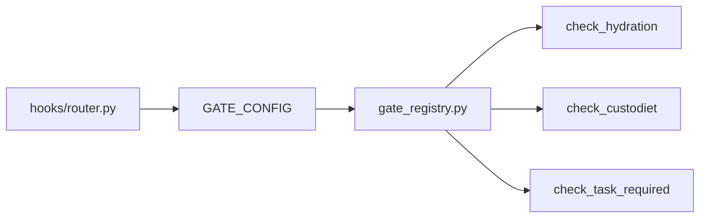

# Claude Code Hooks: Complete Technical Reference

This document covers both Claude Code's hook system and the academicOps implementation. All hooks live in `$AOPS/hooks/`.

## academicOps Active Hooks

| File                        | Event            | Purpose                               |
| --------------------------- | ---------------- | ------------------------------------- |
| session_env_setup.sh        | SessionStart     | Environment setup                     |
| sessionstart_load_axioms.py | SessionStart     | Injects AXIOMS, FRAMEWORK, HEURISTICS |
| user_prompt_submit.py       | UserPromptSubmit | Context enrichment via temp file      |
| policy_enforcer.py          | PreToolUse       | Block destructive operations          |
| autocommit_state.py         | PostToolUse      | Auto-commit data/ changes             |
| unified_logger.py           | ALL events       | Universal event logging               |

**Architecture principle**: Hooks inject context - they don't do LLM reasoning. Timeouts: 2-30 seconds. Hooks must NOT call the Claude/Anthropic API directly.

## Router Architecture

All hooks are dispatched through a single router (`hooks/router.py`). This consolidates multiple hook outputs into a single response. The router is **unified for both Claude Code and Gemini CLI** - the same router.py handles both platforms.

All schemas are consolidated in `hooks/schemas.py` (Pydantic models for HookContext, CanonicalHookOutput, ClaudeHookOutput, GeminiHookOutput, etc.).

### Async Dispatch

Hooks can run async to maximize execution time. Add `"async": True` to the hook config:

1. Start async hook
2. Run other hooks sync
3. Collect async hook result
4. Merge all outputs

### Adding New Hooks

Register hooks in `HOOK_REGISTRY` in `hooks/router.py`:

```python
HOOK_REGISTRY = {
    "SessionStart": [
        {"script": "session_env_setup.sh"},
        {"script": "your_new_hook.py"},
    ],
}
```

For async execution, add `"async": True`:

```python
{"script": "slow_hook.py", "async": True}
```

After adding a hook, run `setup.sh` to rebuild and reinstall the extension (see Deployment Architecture below).

## academicOps Deployment Architecture

academicOps uses a **three-phase build system** for hooks, not the standard Claude Code settings.json approach. Hooks are bundled into the Gemini extension package and installed atomically.

### Phase 1: Source

Hooks live in `$AOPS/aops-core/hooks/`:

```
aops-core/hooks/
├── router.py              # Unified dispatcher (Claude + Gemini)
├── sessionstart_load_axioms.py
├── user_prompt_submit.py
├── policy_enforcer.py
├── autocommit_state.py
├── unified_logger.py
├── lib/                   # Shared utilities
├── templates/             # Template files for context injection
└── gemini/                # LEGACY - not used (unified router replaced this)
```

### Phase 2: Build (`scripts/build.py`)

The build script **copies** hooks to the distribution directory:

```
$AOPS/aops-core/hooks/ → $AOPS/dist/aops-core/hooks/
```

Key behaviors:
- Hooks are **copied**, not symlinked (avoids source pollution)
- `gemini/` subdirectory is **not copied** (uses unified router)
- `router.py` is the single entry point for all hook events
- Variable substitution: `${AOPS}` replaced with absolute path

### Phase 3: Install (`scripts/install.py`)

The extension is linked via Gemini CLI:

```bash
gemini extensions link dist/aops-core --consent
```

This registers the extension with Gemini, including the hooks defined in `gemini-extension.json`.

### Extension Manifest (`gemini-extension.json`)

Hooks are registered in the extension manifest, **not** in settings.json:

```json
{
  "name": "aops-core",
  "hooks": {
    "SessionStart": [{
      "matcher": "startup",
      "hooks": [{
        "name": "aops-router",
        "type": "command",
        "command": "uv run --directory ${AOPS} python ${AOPS}/dist/aops-core/hooks/router.py SessionStart",
        "timeout": 15000
      }]
    }],
    "BeforeTool": [{
      "matcher": "*",
      "hooks": [{
        "name": "aops-router",
        "type": "command",
        "command": "uv run --directory ${AOPS} python ${AOPS}/dist/aops-core/hooks/router.py BeforeTool",
        "timeout": 5000
      }]
    }]
  }
}
```

**Key differences from standard Claude Code:**

| Aspect | Standard Claude Code | academicOps |
|--------|---------------------|-------------|
| Config location | `settings.json` | `gemini-extension.json` |
| Hook paths | Absolute paths or `$CLAUDE_PROJECT_DIR` | `${AOPS}/dist/aops-core/hooks/router.py` |
| Installation | Manual settings edit | `gemini extensions link` |
| Hook scripts | Individual scripts per event | Single router dispatches all |
| Rebuild needed | No (settings hot-reload) | Yes (`setup.sh` after changes) |

### Workflow: Adding or Modifying Hooks

1. Edit hooks in `$AOPS/aops-core/hooks/`
2. If adding a new hook, register in `HOOK_REGISTRY` in `router.py`
3. Run `setup.sh` (triggers build.py → install.py)
4. Test with `gemini --debug` to verify hooks are loading

### Event Name Mapping

Gemini CLI uses different event names than Claude Code:

| Claude Code | Gemini CLI |
|-------------|------------|
| SessionStart | SessionStart |
| PreToolUse | BeforeTool |
| PostToolUse | AfterTool |
| UserPromptSubmit | BeforeAgent |
| Stop | SessionEnd |

The router handles this mapping transparently - register hooks using Claude Code event names in `HOOK_REGISTRY`, and the router translates for Gemini

---

# Claude Code Hook System: Configuration Reference

Claude Code CLI **can load SessionStart hooks from paths outside the current working directory**, but the mechanism differs from what many developers expect. Hooks are configured through a hierarchical settings system, not auto-discovered from directories, and commands within those hooks can reference scripts anywhere on the filesystem using absolute paths or the `$CLAUDE_PROJECT_DIR` environment variable.

This finding is critical for multi-project setups: you can maintain a centralized hooks repository and reference it from any project by configuring global settings at `~/.claude/settings.json` or by using absolute paths in project-specific configurations.

## How hook discovery actually works

Claude Code uses a **configuration-based discovery system**, not a file-scanning system. At startup, Claude Code loads `settings.json` files from multiple locations in strict hierarchical order, merges their configurations, and creates an immutable snapshot of all hook definitions for that session. External edits during a session require review via the `/hooks` menu before taking effect—a security feature preventing malicious modifications.

**The discovery hierarchy (highest to lowest priority):**

1. **Enterprise managed settings** — System administrators define org-wide policies that cannot be overridden
   - macOS: `/Library/Application Support/ClaudeCode/managed-settings.json`
   - Linux/WSL: `/etc/claude-code/managed-settings.json`
   - Windows: `C:\ProgramData\ClaudeCode\managed-settings.json`

2. **CLI arguments** — Runtime settings via `--settings` flag

3. **Project local settings** — Personal overrides not committed to version control
   - Location: `.claude/settings.local.json` in current working directory
   - Automatically git-ignored by Claude Code

4. **Project shared settings** — Team-wide configuration checked into source control
   - Location: `.claude/settings.json` in current working directory

5. **User global settings** — Personal defaults across all projects
   - Location: `~/.claude/settings.json`

6. **Legacy configuration** — Deprecated but still functional for backward compatibility
   - Location: `~/.claude.json` or `~/.claude/claude.json`

Settings at higher precedence levels override lower ones, with arrays being replaced entirely rather than merged. The `.claude/hooks/` directory commonly seen in examples is purely a **convention for organizing scripts**—it's not automatically scanned. Scripts placed there must be explicitly referenced in a `settings.json` file's hook configuration.

## Configuration file structure and schema

Claude Code exclusively uses **JSON format** for configuration files. YAML and TOML are not supported for primary configuration, though YAML appears as frontmatter in subagent and slash command Markdown files.

**Complete settings.json schema:**

```json
{
  "model": "claude-sonnet-4-20250514",
  "maxTokens": 4096,
  "autoUpdates": true,

  "permissions": {
    "allowedTools": [
      "Read",
      "Write(src/**)",
      "Bash(git *)",
      "Bash(npm *)"
    ],
    "deny": [
      "Read(./.env)",
      "Read(./.env.*)",
      "Read(./secrets/**)",
      "Write(./production.config.*)",
      "Bash(rm *)",
      "Bash(sudo *)"
    ]
  },

  "hooks": {
    "SessionStart": [{
      "matcher": "startup|resume|clear",
      "hooks": [{
        "type": "command",
        "command": "$CLAUDE_PROJECT_DIR/.claude/hooks/session_start.sh",
        "timeout": 60
      }]
    }],
    "PostToolUse": [{
      "matcher": "Write(*.py)",
      "hooks": [{
        "type": "command",
        "command": "python -m black $file"
      }]
    }]
  },

  "env": {
    "ANTHROPIC_MODEL": "claude-sonnet-4-20250514",
    "BASH_DEFAULT_TIMEOUT_MS": "30000",
    "DISABLE_TELEMETRY": "1"
  },

  "enabledPlugins": {
    "formatter@company-tools": true
  },

  "apiKeyHelper": "/path/to/key-helper-script.sh",
  "parallelTasksCount": 3
}
```

**The .claude directory structure:**

```
~/.claude/                          # User-level configuration
├── settings.json                   # User settings applied to all projects
├── claude.json                     # Legacy config (deprecated)
├── CLAUDE.md                       # Global context/instructions
├── CLAUDE.local.md                # Personal global context (git-ignored)
├── agents/                        # User-level subagents (Markdown + YAML)
├── commands/                      # User-level slash commands
└── hooks/                         # Convention for organizing hook scripts

<project-root>/.claude/            # Project-level configuration
├── settings.json                  # Shared team settings (committed to git)
├── settings.local.json           # Personal project settings (git-ignored)
├── CLAUDE.md                      # Project instructions/memory
├── CLAUDE.local.md               # Personal project context
├── agents/                       # Project-specific subagents
├── commands/                     # Project-specific slash commands
└── hooks/                        # Project hook scripts
```

The `.mcp.json` file at the project root configures Model Context Protocol servers and can be version-controlled for team-wide tool availability. There is **no `.claude_config.json` file**—only `settings.json` variants are recognized.

**Environment variables** can override any configuration setting. Critical variables include `ANTHROPIC_API_KEY` for authentication, `CLAUDE_PROJECT_DIR` (available during hook execution), `BASH_DEFAULT_TIMEOUT_MS`, `CLAUDE_CODE_MAX_OUTPUT_TOKENS`, and privacy controls like `DISABLE_TELEMETRY`. All environment variables can be defined persistently in the `env` object within `settings.json`.

## Multi-project setup patterns and shared frameworks

Three documented patterns enable sharing SessionStart hooks across multiple projects, each with specific trade-offs for polyrepo architectures.

**Pattern 1: Global hooks in user settings**

Define hooks once in `~/.claude/settings.json` and they automatically apply to every project you work on. This is the simplest approach for personal consistency:

```json
{
  "hooks": {
    "SessionStart": [{
      "hooks": [{
        "type": "command",
        "command": "~/.claude/hooks/global_session_start.py"
      }]
    }]
  }
}
```

Store your hook scripts in `~/.claude/hooks/` and reference them with absolute paths or tilde expansion. Global hooks get merged with project-specific hooks, so teams can layer organization standards (global) with project requirements (local).

**Pattern 2: Symlinked CLAUDE.md files for shared context**

While you can't configure arbitrary `settings.json` paths via environment variables, symlinks work for sharing instruction files across projects:

```bash
# Create shared context repository
mkdir ~/.ai-context
touch ~/.ai-context/coding-standards.md

# Symlink as CLAUDE.md in multiple projects
cd ~/project-a && ln -s ~/.ai-context/coding-standards.md ./CLAUDE.md
cd ~/project-b && ln -s ~/.ai-context/coding-standards.md ./CLAUDE.md
```

**Known issue**: Symlinks to `~/.claude` directory itself have reported problems (GitHub issue #764). The workaround is to symlink individual files or use direct absolute paths in hook commands rather than symlinking the hook scripts themselves. Issue #5433 documents hooks failing silently when executed through symlinked directories.

**Pattern 3: Multi-directory access with --add-dir**

Work across multiple repositories in a single session by adding directories at startup or mid-session:

```bash
# At startup: Reference backend while working on frontend
claude --add-dir ../backend-api --add-dir ~/shared/libraries

# During session
/add-dir ../backend-api
```

This enables polyrepo workflows where you need cross-repository context. However, CLAUDE.md files in directories added via `--add-dir` are **not automatically loaded** (GitHub issue #3146), limiting context sharing through this mechanism.

**Pattern 4: Plugin-based distribution**

The plugin system (in public beta) packages hooks, commands, and configurations for distribution. Teams can create private plugin marketplaces:

```bash
# Add company plugin marketplace
/plugin marketplace add company/claude-plugins

# Install shared hooks/commands
/plugin install company-standards
```

**Real-world implementations** demonstrate these patterns in production. The GitButler integration uses SessionStart hooks to initialize shadow git worktrees for change tracking. The disler/claude-code-hooks-mastery repository provides reference implementations of all 8 hook lifecycle events. Teams at companies like Neon Engineering publish standardized hooks for notifications, code formatting, type checking, and test running.

For polyrepo setups specifically, the recommended hybrid approach combines global user settings for personal standards, project-specific `.claude/settings.json` for team requirements, plugins for organizational standards, and `--add-dir` for cross-repository sessions when needed.

## Path resolution rules and edge cases

Path resolution in Claude Code has specific behaviors that affect reliability, particularly for hooks referencing scripts outside the project directory.

**Relative paths resolve from the current working directory** where Claude Code was launched, **not** from the hook file location or configuration file location. This creates portability issues. If you define a hook command as `.claude/hooks/script.sh` and run `claude` from different directories, the relative path resolves differently each time. GitHub issue #4754 documents inconsistent behavior when relative paths in CLAUDE.md reference files, attempting to load from CWD instead of relative to the CLAUDE.md location.

**Absolute paths are officially recommended** and eliminate ambiguity. From the official documentation and community repositories: "If your hook scripts aren't executing properly, it might be due to relative paths in your settings.json. Claude Code documentation recommends using absolute paths for command scripts."

**Environment variables are fully supported** with `$CLAUDE_PROJECT_DIR` being the most critical. This special variable contains the absolute path to the project root (where Claude Code started) and is available during all hook executions:

```json
{
  "hooks": {
    "PostToolUse": [{
      "matcher": "Write|Edit",
      "hooks": [{
        "type": "command",
        "command": "\"$CLAUDE_PROJECT_DIR\"/.claude/hooks/check-style.sh"
      }]
    }]
  }
}
```

Note the escaped quotes around the variable—necessary for paths containing spaces, particularly on Windows. Standard shell variables like `$HOME`, `$PATH`, and `$PYTHONPATH` also work. Plugin hooks get access to `${CLAUDE_PLUGIN_ROOT}` for plugin-relative paths.

**Tilde expansion** (`~`) works correctly for home directory references. You can use `~/external-scripts/hook.sh` in hook commands, though this creates a **security consideration** documented in GitHub issue #3275: Claude Code can access and modify files anywhere on the filesystem using absolute paths or tilde expansion, even outside the working directory. The permission system provides protection:

```json
{
  "permissions": {
    "deny": [
      "Read(/etc/**)",
      "Write(/var/**)",
      "Bash(sudo *)"
    ]
  }
}
```

**Symlinks have multiple known issues**. When `~/.claude` is itself a symlink (common for dotfiles management), Claude Code may fail to detect files in that directory. Hook scripts accessed through symlinked directories can hang indefinitely with no error messages (issue #5433). The workaround is using direct absolute paths to the actual file locations rather than symlink paths. A July 2025 fix addressed symlink resolution for settings files specifically, but symlink handling remains fragile in general.

**Windows presents additional challenges**. Issue #9542 reports SessionStart hooks cause infinite hangs on Windows (though they work on macOS and Linux). Issues #3594, #4079, and #4507 document Windows path resolution errors with spaces in paths like `C:\Program Files\Git`. Proper quoting is essential on Windows.

**Accessing files outside the project directory is possible** through absolute paths, tilde expansion, or the `--add-dir` flag. This is intentional for multi-project workflows but requires careful permission management to prevent unintended file access.

## Concrete answer to the critical question

**Can you configure Claude Code to load a SessionStart hook from a path outside the current working directory?**

**Yes, through two mechanisms:**

1. **Hook commands can reference external scripts** using absolute paths or tilde expansion:

```json
{
  "hooks": {
    "SessionStart": [{
      "hooks": [{
        "type": "command",
        "command": "/Users/username/shared-hooks/session_start.sh"
      }]
    }]
  }
}
```

Place this configuration in **any** settings.json location—project-level (`.claude/settings.json`) or user-level (`~/.claude/settings.json`)—and the command will execute the script from the external location.

2. **Global settings automatically apply to all projects**:

```json
// In ~/.claude/settings.json
{
  "hooks": {
    "SessionStart": [{
      "hooks": [{
        "type": "command",
        "command": "~/personal-context-repo/hooks/load-context.py"
      }]
    }]
  }
}
```

This configuration in your user-level settings will run for every project without needing project-specific configuration.

**What you cannot do** is specify an arbitrary `settings.json` file location via environment variables. The settings files must be in the standard hierarchy locations. However, since hook commands themselves accept any path, you can maintain a centralized hooks repository and reference it from the standard settings locations.

**Recommended implementation for flat architecture:**

```bash
# Your structure
~/personal-context/
  ├── hooks/
  │   └── session_start.sh
  └── instructions/
      └── coding-standards.md

~/projects/
  ├── project-a/.claude/settings.json
  └── project-b/.claude/settings.json
```

**In ~/.claude/settings.json (global approach):**

```json
{
  "hooks": {
    "SessionStart": [{
      "hooks": [{
        "type": "command",
        "command": "~/personal-context/hooks/session_start.sh"
      }]
    }]
  }
}
```

**Or in each project's .claude/settings.json:**

```json
{
  "hooks": {
    "SessionStart": [{
      "hooks": [{
        "type": "command",
        "command": "/absolute/path/to/personal-context/hooks/session_start.sh"
      }]
    }]
  }
}
```

The SessionStart hook script can then load external instruction files into context programmatically.

## Gemini CLI Hook System (Updated February 2026)

Gemini CLI now has a **full hook system** mirroring Claude Code's capabilities. The implementation landed in late 2025 following GitHub issue #9070.

### Gemini CLI Hook Events

| Event | Description | Blocking? |
|-------|-------------|-----------|
| **SessionStart** | On startup/resume/clear | No (advisory) |
| **SessionEnd** | On exit | No (advisory) |
| **BeforeTool** | Before tool invocation | Yes (exit 2) |
| **AfterTool** | After tool execution | Yes (exit 2) |
| **BeforeAgent** | After user prompt, before planning | Yes (exit 2) |
| **AfterAgent** | After model generates response | Yes (exit 2) |
| **BeforeModel** | Before LLM request | Yes (exit 2) |
| **AfterModel** | After LLM response chunk | Yes (exit 2) |
| **BeforeToolSelection** | Before tool decision | No (config only) |
| **Notification** | System alerts | No (advisory) |
| **PreCompress** | Before history compression | No (advisory) |

### Gemini CLI Output Schema

```json
{
  "systemMessage": "string (user-facing)",
  "decision": "allow | deny | block",
  "reason": "string (explanation for denial)",
  "hookSpecificOutput": {
    "hookEventName": "string",
    "additionalContext": "string (injected into prompt)",
    "toolConfig": { "mode": "AUTO|ANY|NONE", "allowedFunctionNames": [] },
    "clearContext": true
  },
  "suppressOutput": true,
  "continue": true,
  "stopReason": "string"
}
```

**Critical field semantics:**
- `reason`: For explaining **denial decisions only**, NOT for context injection
- `hookSpecificOutput.additionalContext`: For **injecting context into the agent's prompt**
- Exit code 2: "Emergency brake" - stderr shown to agent, operation blocked

### Event Name Mapping (academicOps Router)

The router normalizes Gemini events to Claude Code equivalents internally:

| Gemini CLI | Claude Code (internal) |
|------------|------------------------|
| SessionStart | SessionStart |
| BeforeTool | PreToolUse |
| AfterTool | PostToolUse |
| BeforeAgent | UserPromptSubmit |
| AfterAgent | AfterAgent |
| SessionEnd | Stop |

### Configuration Comparison

| Aspect | Claude Code CLI | Gemini CLI |
|--------|-----------------|------------|
| **Hooks system** | 8 lifecycle events | 11 lifecycle events |
| **Configuration** | `~/.claude/settings.json` | `~/.gemini/settings.json` or extension manifest |
| **Context/memory** | `CLAUDE.md` | `GEMINI.md` |
| **MCP servers** | Separate `.mcp.json` | In main settings.json |
| **Extension system** | Plugins (beta) | Extensions (`gemini extensions link`) |

**Both CLIs can coexist** on the same system without conflicts—they use different configuration directories and context files. MCP servers are fully compatible since both implement the Model Context Protocol standard.

**academicOps unified router**: The `hooks/router.py` handles both Claude Code and Gemini CLI through a single codebase, normalizing inputs and outputs for each platform.

## Known limitations and issues

**Windows-specific problems** include SessionStart hooks causing infinite hangs (issue #9542) and path resolution failures with spaces in paths (issues #3594, #4079, #4507). Windows users should test hooks thoroughly and consider workarounds like WSL for reliability.

**Symlink fragility** affects multiple scenarios: symlinked `~/.claude` directories fail to detect files properly, hooks executed through symlinked paths hang silently, and relative paths in symlinked CLAUDE.md files attempt loading from wrong locations. Direct absolute paths avoid these issues.

**Configuration file discovery** never checks for `.claude_config.json` despite this being a common assumption. Only `settings.json` (in various locations) and the legacy `claude.json` are recognized.

**XDG Base Directory non-compliance** on Linux (issue #1455) means Claude Code always uses `~/.claude` regardless of `$XDG_CONFIG_HOME` or other XDG environment variables.

**CLAUDE.md files in added directories** aren't automatically loaded when using `--add-dir` (issue #3146), limiting context sharing in multi-directory sessions.

**No official JSON schema** exists for settings.json despite community requests (issue #2783), making validation and IDE autocomplete unavailable.

**Hook debugging** requires the `--debug` flag for visibility into execution. Silent failures can occur with symlinks or misconfigured paths.

## Best practices and recommendations

**For hook configuration:**

- Always use absolute paths in hook commands: `/absolute/path/script.sh` or `~/relative-to-home.sh`
- Leverage `$CLAUDE_PROJECT_DIR` for project-relative scripts: `"$CLAUDE_PROJECT_DIR/.claude/hooks/script.sh"`
- Quote paths that might contain spaces: `"\"$CLAUDE_PROJECT_DIR\"/script.sh"`
- Avoid symlinks for hook scripts themselves; symlink CLAUDE.md files if needed for context sharing
- Test hooks with `claude --debug` to see execution details
- Set appropriate timeouts: `"timeout": 30` in hook configuration

**For multi-project setups:**

- Store personal standards in `~/.claude/settings.json` as global hooks
- Commit `.claude/settings.json` to version control for team-shared configurations
- Use `.claude/settings.local.json` (git-ignored) for personal project overrides
- Organize hook scripts in `.claude/hooks/` by convention, even though not auto-discovered
- Consider plugins for distributing organizational standards across teams
- Use `--add-dir` for cross-repository context when needed

**For security:**

- Define `permissions.deny` patterns for sensitive paths like `.env` files and `/etc/**`
- Review hook commands before adding (they execute with your credentials)
- Use the `/hooks` interactive menu to review externally modified hooks before activation
- Be aware hooks can access files outside project directory via absolute paths

**For Windows users:**

- Test SessionStart hooks thoroughly; they have known reliability issues
- Use WSL if encountering persistent path resolution problems
- Double-quote all paths containing spaces
- Avoid `Program Files` paths in hook commands when possible

**For polyrepo workflows:**

- Maintain a centralized hooks repository in `~/shared-hooks/` or similar
- Reference it from global settings for personal use: `~/shared-hooks/session_start.sh`
- Or reference from project settings for team use: `/team/shared/hooks/session_start.sh`
- Use git worktrees for parallel Claude instances on the same repository
- Consider GitButler hooks for automatic session isolation into branches

The flat architecture pattern—maintaining a personal context repository outside project directories and referencing it via hooks with absolute paths—is fully supported and represents a documented best practice for sophisticated multi-project setups.

## Hook Input/Output Schemas (academicOps Implementation)

Based on analysis of actual hook execution logs and our Pydantic models in `bots/hooks/hook_models.py`:

### Common Input Structure (All Hooks)

All hooks receive JSON on stdin with these common fields:

```json
{
  "session_id": "uuid-string",
  "transcript_path": "/path/to/.claude/projects/[project]/[session-id].jsonl",
  "cwd": "/current/working/directory",
  "permission_mode": "bypassPermissions" | "requirePermissions",
  "hook_event_name": "PreToolUse" | "PostToolUse" | "UserPromptSubmit" | "SessionStart" | "Stop" | "SubagentStop"
}
```

### PreToolUse Hook

**Input** (in addition to common fields):

```json
{
  "tool_name": "Bash" | "Read" | "Write" | "Edit" | "Grep" | "Glob" | ...,
  "tool_input": {
    // Tool-specific parameters
    // Examples:
    // Bash: {"command": "ls -la", "description": "..."}
    // Read: {"file_path": "/path/to/file"}
    // Write: {"file_path": "/path", "content": "..."}
    // Edit: {"file_path": "/path", "old_string": "...", "new_string": "..."}
  }
}
```

**Output** (required structure):

```json
{
  "hookSpecificOutput": {
    "hookEventName": "PreToolUse",
    "permissionDecision": "allow" | "deny" | "ask",
    "permissionDecisionReason": "Optional explanation"
  },
  "continue": true | false,
  "systemMessage": "Optional warning shown to user",
  "stopReason": "Optional message when continue=false"
}
```

**Exit codes** (CRITICAL - determines what Claude Code reads):

| Exit | Action      | Message source     | Shown to            |
| ---- | ----------- | ------------------ | ------------------- |
| `0`  | Allow       | JSON on **stdout** | User (verbose mode) |
| `1`  | Warn, allow | **stderr**         | User AND agent      |
| `2`  | Block       | **stderr**         | Agent only          |

**Key point**: Exit 2 ignores stdout entirely - only stderr is read. This is why `continue: false` in JSON doesn't block if you exit 2.

### PostToolUse Hook

**Input** (in addition to common fields):

```json
{
  "tool_name": "Bash" | "Read" | "Write" | ...,
  "tool_input": {
    // Same as PreToolUse
  },
  "tool_response": {
    "type": "text" | "error" | ...,
    // Tool-specific response data
    // Examples:
    // Read: {"file": {"filePath": "...", "content": "...", "numLines": 56, ...}}
    // Bash: {"output": "command output", "exitCode": 0}
  }
}
```

**Output**:

```json
{
  "hookSpecificOutput": {
    "hookEventName": "PostToolUse",
    "additionalContext": "Optional context injected into conversation"
  },
  "continue": true | false,
  "systemMessage": "Optional message",
  "suppressOutput": true | false
}
```

**Exit code**: Always `0` (PostToolUse hooks don't block)

### UserPromptSubmit Hook

**Input** (in addition to common fields):

```json
{
  "prompt": "The user's input text"
}
```

**Output**:

```json
{
  "hookSpecificOutput": {
    "hookEventName": "UserPromptSubmit",
    "additionalContext": "Optional context to inject"
  },
  "continue": true | false,
  "systemMessage": "Optional message"
}
```

**Exit code**: Always `0`

### SessionStart Hook

**Input** (in addition to common fields):

```json
{
  // No additional fields beyond common structure
}
```

**Output**:

```json
{
  "hookSpecificOutput": {
    "hookEventName": "SessionStart",
    "additionalContext": "Context injected at session start (instructions, environment info, etc.)"
  },
  "systemMessage": "Optional startup message",
  "suppressOutput": true | false
}
```

**Exit code**: `0` for success

### Stop and SubagentStop Hooks

**Input** (in addition to common fields):

```json
{
  // No additional fields beyond common structure
}
```

**Output** (CRITICAL - must exit 0 for JSON to be processed!):

```json
{
  "decision": "block",
  "reason": "Explanation shown to CLAUDE - tells agent what to do",
  "stopReason": "Message shown to USER"
}
```

**Field visibility:**

| Field | Shown to | Purpose |
| --- | --- | --- |
| `reason` | **Claude only** | Instructions for the agent when blocked |
| `stopReason` | **User only** | Explains why session was blocked |
| `systemMessage` | **User only** | Warning message (optional) |

**Exit codes (CRITICAL):**

| Exit | JSON processed? | Result |
| --- | --- | --- |
| `0` | ✅ Yes | `decision: "block"` blocks, `reason` shown to Claude |
| `1` | ❌ No | Warn but allow, stderr shown to user |
| `2` | ❌ **No - JSON ignored!** | Only stderr used, agent sees stderr text |

**IMPORTANT**: Exit code 2 completely ignores stdout JSON. If you want Claude to see your message, you MUST:
1. Use `"decision": "block"` with `"reason": "..."` in JSON
2. Exit with code 0 (not 2!)

**Example - Correct blocking pattern:**

```python
# CORRECT: Exit 0 with decision:block
output = {
    "decision": "block",
    "reason": "Please commit your changes before ending: git add -A && git commit",
    "stopReason": "Session blocked: uncommitted changes detected"
}
print(json.dumps(output))
sys.exit(0)  # Must be 0 for JSON to be processed!

# WRONG: Exit 2 ignores JSON entirely
print(json.dumps({"continue": False, "reason": "..."}))
sys.exit(2)  # Claude never sees the JSON - only stderr!
```

**Router consolidation warning**: If using a router to dispatch multiple Stop hooks, the router's `merge_outputs` function must explicitly preserve `decision`, `reason`, and `stopReason` fields. These are NOT part of `hookSpecificOutput` (which only applies to PreToolUse, PostToolUse, UserPromptSubmit). A router that only handles `hookSpecificOutput` will silently strip Stop hook response fields, causing messages to never reach the agent. See `aops-core/hooks/router.py` for the correct implementation pattern.

### Environment Variables Available in Hooks

- `$CLAUDE_PROJECT_DIR` - Absolute path to project root (where Claude Code started)
- `$CLAUDE_PLUGIN_ROOT` - For plugin hooks, path to plugin directory
- **Custom variables** - Shell environment variables work in hook commands (e.g., `$AOPS` for centralized framework path)
- Standard shell variables: `$HOME`, `$PATH`, `$PYTHONPATH`, etc.
- Any variables defined in `settings.json` `env` object

### Best Practices for Hook Implementation

1. **Always output valid JSON** - Even on error, output `{}` and exit 0
2. **Validate input defensively** - Check for missing fields before accessing
3. **Use Pydantic models** - Validate output structure (see `bots/hooks/hook_models.py`)
4. **Handle errors gracefully** - Wrap logic in try/except, never crash
5. **Log for debugging** - Use separate log files (e.g., `/tmp/claude_*.json`)
6. **Set timeouts** - Configure reasonable timeout in settings (default 2-5s)
7. **Absolute paths** - Use `$CLAUDE_PROJECT_DIR` or absolute paths, not relative
8. **Exit codes matter** - PreToolUse: 0=allow (stdout), 1=warn (stderr), 2=block (stderr only); Others: always 0

### Example: Minimal Hook Implementation

```python
#!/usr/bin/env python3
import json
import sys


def main():
    # Read input
    try:
        input_data = json.load(sys.stdin)
    except:
        input_data = {}

    # Process (hook-specific logic)
    output = {
        "hookSpecificOutput": {
            "hookEventName": "PreToolUse",  # or SessionStart, etc.
            "permissionDecision": "allow",  # PreToolUse only
        }
    }

    # Output and exit
    print(json.dumps(output))
    sys.exit(0)


if __name__ == "__main__":
    main()
```

### additionalContext Can Trigger Tool Use (Proven 2025-11-22)

The `additionalContext` field in hook output doesn't just add text context—it can **instruct the agent to use specific tools**, including spawning subagents.

**Tested and verified capabilities:**

| Tool | additionalContext Instruction              | Result                                      |
| ---- | ------------------------------------------ | ------------------------------------------- |
| Read | "MUST use Read tool to read /tmp/file.txt" | Agent reads file, includes content          |
| Bash | "MUST use Bash tool to run 'echo TEST'"    | Agent executes command                      |
| Task | "MUST use Task tool to spawn subagent"     | Agent spawns subagent with specified params |

**Critical requirements for tool triggering:**

1. **Correct output format** - Must use full wrapper structure:

```json
{
  "hookSpecificOutput": {
    "hookEventName": "UserPromptSubmit",
    "additionalContext": "BEFORE answering, you MUST use the Task tool..."
  }
}
```

2. **Non-conflicting instructions** - If multiple hooks inject additionalContext with conflicting instructions (e.g., "HALT" vs "spawn subagent"), agent behavior is unpredictable.

3. **Cannot replace user prompt** - Hooks can only ADD context or BLOCK entirely. They cannot modify or replace the user's input text.

**Example: Spawning a subagent from UserPromptSubmit hook:**

```python
#!/usr/bin/env python3
import json
import sys

output = {
    "hookSpecificOutput": {
        "hookEventName": "UserPromptSubmit",
        "additionalContext": (
            "BEFORE answering, use the Task tool to spawn a subagent. "
            "Use subagent_type='Explore', model='haiku', "
            "prompt='Classify this prompt intent', description='Intent classifier'. "
            "Include the subagent result in your response."
        )
    }
}
print(json.dumps(output))
sys.exit(0)
```

**Use cases enabled by this capability:**

- **Prompt routing**: Classify user intent before responding
- **Context enrichment**: Load relevant files/data based on prompt
- **Quality gates**: Run checks before answering
- **Workflow automation**: Trigger specific tools based on prompt patterns

### Debugging Hook Execution

All hook I/O is automatically logged by the router to per-session JSONL files:

```
~/.claude/projects/<project>/<date>-<shorthash>-hooks.jsonl
```

Run Claude Code with debug flag to see hook execution:

```bash
claude --debug
```

View hook logs for the current session:

```bash
ls -lt ~/.claude/projects/*/202*-hooks.jsonl | head
cat ~/.claude/projects/<project>/<date>-<hash>-hooks.jsonl | jq .
```

## Python Hook Implementation Conventions (academicOps)

This section covers Python-specific conventions for implementing hooks in the academicOps framework.

### File Organization

**Location**: All Python hooks in `$AOPS/hooks/`

**Naming**: `{event}_{purpose}.py` or `{purpose}_{event}.py`

- `sessionstart_load_axioms.py` - SessionStart event, loads axioms
- `policy_enforcer.py` - PreToolUse event, enforces policies
- `fail_fast_watchdog.py` - PostToolUse event, enforces fail-fast

**Rules**:

- Snake_case, no `hook_` prefix
- One purpose per file (router consolidates)

### Required Structure

```python
#!/usr/bin/env python3
"""
{Event} hook for Claude Code.

{One-line description}.

Exit codes:
    0: Success
    1: Warning (fail-fast applies)
    2: Block (PreToolUse only)
"""
import contextlib
import json
import sys
from pathlib import Path
from typing import Any

from lib.paths import get_plugin_root, get_data_root  # NEVER hardcode paths


def main():
    """Main hook entry point."""
    input_data: dict[str, Any] = {}
    with contextlib.suppress(Exception):
        input_data = json.load(sys.stdin)

    # Process...
    output_data = {"hookSpecificOutput": {"hookEventName": "PreToolUse"}}

    print(json.dumps(output_data))
    sys.exit(0)


if __name__ == "__main__":
    main()
```

### Type Hints

- Use `dict[str, Any]` (Python 3.9+)
- Use `Path` for file paths
- Use `str | None` for optional (Python 3.10+)

### Error Handling Patterns

**Safe Input Parsing** (always):

```python
input_data: dict[str, Any] = {}
with contextlib.suppress(Exception):
    input_data = json.load(sys.stdin)
tool_name = input_data.get("tool_name", "")  # Use .get() with defaults
```

**Critical Operations** (fail-fast per AXIOM #7):

```python
try:
    config = load_required_config()
except FileNotFoundError as e:
    print(f"ERROR: {e}", file=sys.stderr)
    sys.exit(1)  # Fail-fast, don't continue
```

**Optional Operations** (graceful degradation):

```python
try:
    context = load_optional_context()
except Exception:
    context = ""  # Continue without
```

### Shared Utilities

| Utility              | Purpose                          | Import                                                  |
| -------------------- | -------------------------------- | ------------------------------------------------------- |
| `lib.paths`          | Path resolution (NEVER hardcode) | `from lib.paths import get_plugin_root, get_data_root`  |
| `lib.session_reader` | Transcript parsing               | `from lib.session_reader import extract_router_context` |

**Note**: Hook logging is centralized in `router.py` - individual hooks don't need to log.

### Router Integration

Hooks register in `router.py` HOOK_REGISTRY:

```python
HOOK_REGISTRY: dict[str, list[dict[str, Any]]] = {
    "SessionStart": [{"script": "sessionstart_load_axioms.py"}],
    "PreToolUse": [{"script": "policy_enforcer.py"}],
    "PostToolUse:TodoWrite": [{"script": "request_scribe.py"}],  # Matcher
}
```

### Anti-Patterns

❌ **Hardcoded paths**: Use `lib.paths`
❌ **Silent critical failures**: Exit 1 on config/I/O errors
❌ **Assume JSON structure**: Always `.get()` with defaults
❌ **Per-hook logging**: Router handles logging centrally
❌ **LLM calls in hooks**: Spawn background subagent instead (H31)

### Checklist: Before Adding a Hook

- [ ] Single focused purpose
- [ ] Shebang + docstring with exit codes
- [ ] Safe input parsing with `.get()` defaults
- [ ] Valid JSON output (test with `jq`)
- [ ] Critical = fail-fast, optional = graceful
- [ ] Using `lib.paths` (no hardcoded paths)
- [ ] Added to `HOOK_REGISTRY` in router.py
- [ ] Tested with sample input

## Design Rationale: GateResult vs CanonicalHookOutput

The academicOps hook system uses two distinct data structures for hook outputs. This is intentional.

### GateResult (lib/gate_model.py)

```python
@dataclass
class GateResult:
    verdict: GateVerdict  # Enum: ALLOW, DENY, WARN, ASK
    system_message: Optional[str] = None
    context_injection: Optional[str] = None
    metadata: Dict[str, Any] = field(default_factory=dict)
```

**Purpose**: Return type for individual gate check functions.

**Characteristics**:
- Simple Python dataclass (fast, minimal dependencies)
- Uses `GateVerdict` enum for type safety
- No serialization logic - gates don't know about JSON
- Returned by functions in `gate_registry.py`

### CanonicalHookOutput (hooks/schemas.py)

```python
class CanonicalHookOutput(BaseModel):
    system_message: Optional[str] = None
    verdict: Optional[Literal["allow", "deny", "ask", "warn"]] = "allow"
    context_injection: Optional[str] = None
    updated_input: Optional[str] = None
    metadata: Dict[str, Any] = Field(default_factory=dict)
```

**Purpose**: Internal format for the router to merge multiple gate results.

**Characteristics**:
- Pydantic model (validation, serialization)
- Uses string literals for verdict (JSON-friendly)
- Has `updated_input` field (for command interception)
- Designed for merging (router accumulates results)

### Why Two Structures?

```
┌─────────────┐     ┌─────────────────────┐     ┌──────────────────┐
│ Gate Check  │────►│ CanonicalHookOutput │────►│ Claude/Gemini    │
│ (GateResult)│     │ (merged, validated) │     │ Output Schema    │
└─────────────┘     └─────────────────────┘     └──────────────────┘
```

1. **Separation of concerns**: Gates are simple, focused checks. They shouldn't know about output formats, merging, or serialization.

2. **Merging capability**: Multiple gates run per event. The router needs to merge their outputs (first deny wins, context concatenates, etc.). CanonicalHookOutput is the accumulator.

3. **Provider agnosticism**: CanonicalHookOutput is the universal internal format. It gets converted to either `ClaudeHookOutput` or `GeminiHookOutput` at the final step.

4. **Validation vs speed**: Pydantic models provide validation for the merged output. Dataclasses are faster for the hot path (individual gate checks).

### Data Flow

```python
# 1. Gate returns GateResult
result = check_hydration(gate_ctx)  # Returns GateResult

# 2. Router converts to CanonicalHookOutput
hook_output = router._gate_result_to_canonical(result)

# 3. Router merges into accumulated output
router._merge_result(merged_result, hook_output)

# 4. Final conversion to provider-specific format
if client == "gemini":
    output = router.output_for_gemini(merged_result, event)
else:
    output = router.output_for_claude(merged_result, event)
```

### Adding a New Gate

1. **Implement** in `gate_registry.py` - return `GateResult`
2. **Register** in `GATE_CHECKS` dictionary
3. **Activate** in `router.py` `GATE_CONFIG` for relevant events

The gate function only deals with `GateResult`. The router handles all conversion and merging.

## Gate Architecture (academicOps)

The aops-core hook system uses a centralized router that delegates to specialized gate functions.



### The Registration Triad

A gate only runs if it is:

1. **Implemented** in `gate_registry.py` (function exists)
2. **Mapped** in `GATE_CHECKS` dictionary (function registered)
3. **Activated** in `GATE_CONFIG` in `router.py` (event → gate list)

**Common bug**: Forgetting step 3. The gate is implemented and registered but never runs because it's not in `GATE_CONFIG`.

### Robust Event Detection

When detecting triggers in text (like "HYDRATION RESULT"), use regex:

```python
# ❌ Bad: Misses casing, bolding, missing markdown
if "## HYDRATION RESULT" in text:

# ✅ Good: Handles variations
re.search(r"(?:##\s*|\*\*)?HYDRATION RESULT", text, re.IGNORECASE)
```

### Debugging

- **Hook logs**: `~/.claude/projects/<project>/<date>-<hash>-hooks.jsonl`
- **Gemini logs**: `~/.gemini/tmp/academicOps-hooks.log`
- **Debug mode**: `claude --debug` or `gemini --debug`
