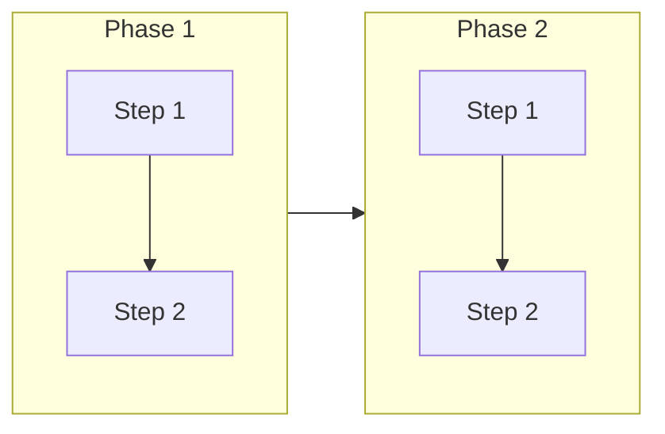
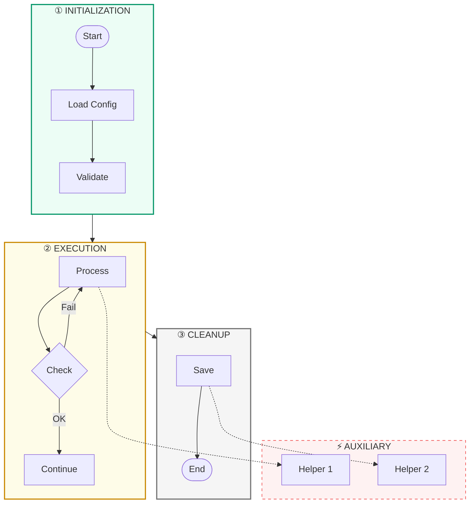

# Mermaid Flowchart Design Skill

**Purpose**: Create Mermaid flowcharts that are clear, readable, and visually attractive.

**Key principle**: One message per chart. Hierarchy and chunking. Obvious flow. Distinct shapes for distinct semantics.

## When to Use This Skill

Use this skill when:

- Creating Mermaid flowcharts for documentation
- Designing process flows, decision trees, or system diagrams
- Documenting execution flows or workflows
- Any task requiring code-based structured diagrams

**Contrast with excalidraw**: Use excalidraw for hand-drawn, organic mind maps. Use flowchart for structured, code-based Mermaid diagrams.

## Universal Chart Craft

### Define One Message Per Chart

- Write a one-line purpose before starting ("This chart shows how a session moves from prompt to cleanup")
- Remove anything that doesn't serve that message
- Use separate charts for deep sub-processes

### Use Hierarchy and Chunking

- Group related steps into visual blocks (subgraphs: "INIT", "PROMPT", "HYDRATE")
- Keep each block under 6-9 nodes
- If it grows, split to a new chart or link out

### Make the Flow Obvious

- Use consistent direction (top-down or left-right)
- Minimize backward arrows and edge crossings
- Put the "happy path" on a straight spine; move exceptions/loops to the side

### Use Distinct Shapes for Distinct Semantics

| Shape         | Mermaid Syntax | Use For       |
| ------------- | -------------- | ------------- |
| Rectangle     | `[text]`       | Process steps |
| Diamond       | `{text}`       | Decisions     |
| Rounded       | `([text])`     | Start/End     |
| Parallelogram | `[/text/]`     | Data/IO       |
| Stadium       | `([text])`     | Terminals     |

### Write Tight, Scannable Labels

- Start with a **verb** ("Invoke skill", "Verify criteria", "HALT + ask user")
- Aim for 3-9 words
- Split long text across `<br/>` lines or move detail to notes/legends

## Color and Styling

Maintain visual hierarchy and accessibility through deliberate color choices and consistent typography.

> See [[references/color-and-styling]] for palettes, accessibility guidelines, and typography rules.

## Layout Strategy: Horizontal Space First

**Default assumption**: Charts are too tall. Optimize for horizontal spread - most users' screens are wider than tall.

### Choose Direction Based on Content

| Content Type              | Direction                          | When to Use                           | Result                          |
| ------------------------- | ---------------------------------- | ------------------------------------- | ------------------------------- |
| Linear process (≤8 steps) | `LR`                               | Simple pipelines, single thread       | 1 tall row, many columns (BEST) |
| Branching/decisions       | `TD`                               | Multiple branches, complex logic      | Wider at branch points          |
| Parallel workflows        | `LR` with `direction TB` subgraphs | Phases left-to-right, steps top-down  | Compact horizontal grouping     |
| Complex systems (>15)     | `LR` + ELK layout                  | Systems with cross-links, multi-layer | Optimal automatic distribution  |

**PRINCIPLE: Prefer LR layout for 80% of use cases.** It naturally spreads horizontally, matching screen dimensions.

### Use ELK for Complex Diagrams

For diagrams with many nodes (>15) or cross-links, ELK layout produces dramatically better results:

```yaml
---
config:
  layout: elk
  elk:
    mergeEdges: true
    nodePlacementStrategy: SIMPLE
---
```

### Mixed-Direction Subgraphs

Place phases horizontally, let steps flow vertically within:



**Critical**: Link between subgraphs, not between internal nodes. Internal-to-external links force direction inheritance.

## Mermaid-Specific Techniques

Master advanced layout tricks, initialization blocks, and professional styling.

> See [[references/mermaid-techniques]] for spacing configurations, multi-layer alignment, and semantic styling.

## Quality and Anti-Patterns

Ensure your charts meet high standards and avoid common Mermaid pitfalls.

> See [[references/quality-and-anti-patterns]] for a final quality checklist and a list of common layout, visual, and structural sins.

## Phase-Based Organization (Recommended for Complex Flows)

For flows with many steps (10+ nodes), organize into **numbered phases** rather than one long chain.



**Key principles:**

1. **Numbered phase labels** (① ② ③) - Creates visual hierarchy and reading order
2. **Phase subgraphs link to each other** - `INIT --> EXEC --> END` keeps main flow clean
3. **Auxiliary systems in dashed side panels** - Hooks, agents, external services
4. **Minimal cross-connections** - Only essential interactions, always dashed
5. **Color-coded phases** - Distinct hues per phase (green → yellow → gray for start → process → end)

## Templates and Examples

See [[references/templates-and-examples.md]] for complete templates including:

- Horizontal process flow (simple linear)
- Multi-phase workflow (phases with internal steps)
- Complex system flow (hook pipelines with ELK layout)
