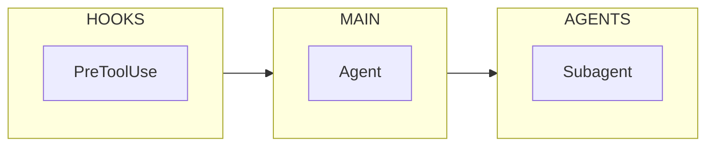
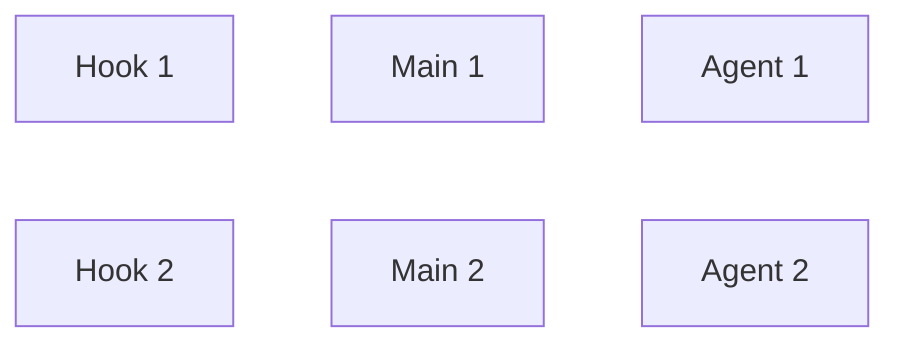
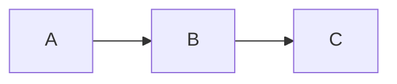

# Mermaid Flowchart Design Skill

**Purpose**: Create Mermaid flowcharts that are clear, readable, and visually attractive.

**Key principle**: One message per chart. Hierarchy and chunking. Obvious flow. Distinct shapes for distinct semantics.

## When to Use This Skill

Use this skill when:

- Creating Mermaid flowcharts for documentation
- Designing process flows, decision trees, or system diagrams
- Documenting execution flows or workflows
- Any task requiring code-based structured diagrams

**Contrast with excalidraw**: Use excalidraw for hand-drawn, organic mind maps. Use flowchart for structured, code-based Mermaid diagrams.

## Universal Chart Craft

### Define One Message Per Chart

- Write a one-line purpose before starting ("This chart shows how a session moves from prompt to cleanup")
- Remove anything that doesn't serve that message
- Use separate charts for deep sub-processes

### Use Hierarchy and Chunking

- Group related steps into visual blocks (subgraphs: "INIT", "PROMPT", "HYDRATE")
- Keep each block under 6-9 nodes
- If it grows, split to a new chart or link out

### Make the Flow Obvious

- Use consistent direction (top-down or left-right)
- Minimize backward arrows and edge crossings
- Put the "happy path" on a straight spine; move exceptions/loops to the side

### Use Distinct Shapes for Distinct Semantics

| Shape         | Mermaid Syntax | Use For       |
| ------------- | -------------- | ------------- |
| Rectangle     | `[text]`       | Process steps |
| Diamond       | `{text}`       | Decisions     |
| Rounded       | `([text])`     | Start/End     |
| Parallelogram | `[/text/]`     | Data/IO       |
| Stadium       | `([text])`     | Terminals     |

### Write Tight, Scannable Labels

- Start with a **verb** ("Invoke skill", "Verify criteria", "HALT + ask user")
- Aim for 3-9 words
- Split long text across `<br/>` lines or move detail to notes/legends

## Color and Styling

### Color for Meaning, Not Decoration

- Limit to **4-5 color roles** max - fewer is better
- Use **contrast ≥ 4.5:1** for text on fills
- **One dominant color** (60%), **one accent** (30%), **one highlight** (10%)
- Avoid red-green pairs for accessibility

### Recommended Palettes

**Modern Dark (recommended for most uses)**:

```
classDef default fill:#2d3748,stroke:#4a5568,color:#e2e8f0
classDef start fill:#276749,stroke:#48bb78,color:#f0fff4,stroke-width:2px
classDef process fill:#2c5282,stroke:#4299e1,color:#ebf8ff
classDef decision fill:#6b46c1,stroke:#9f7aea,color:#faf5ff,stroke-width:2px
classDef error fill:#c53030,stroke:#fc8181,color:#fff5f5
```

**Clean Light** (for formal documents):

```
classDef default fill:#f7fafc,stroke:#a0aec0,color:#2d3748
classDef start fill:#c6f6d5,stroke:#38a169,color:#22543d,stroke-width:2px
classDef process fill:#e2e8f0,stroke:#718096,color:#2d3748
classDef decision fill:#e9d8fd,stroke:#805ad5,color:#44337a,stroke-width:2px
classDef error fill:#fed7d7,stroke:#e53e3e,color:#742a2a
```

**High Contrast** (accessibility-first):

```
classDef default fill:#ffffff,stroke:#000000,color:#000000,stroke-width:2px
classDef start fill:#000000,stroke:#000000,color:#ffffff,stroke-width:3px
classDef process fill:#ffffff,stroke:#000000,color:#000000,stroke-width:2px
classDef decision fill:#ffff00,stroke:#000000,color:#000000,stroke-width:3px
classDef error fill:#ff0000,stroke:#000000,color:#ffffff,stroke-width:2px
```

**Warm Professional** (modern, approachable):

```
classDef default fill:#f5f5f5,stroke:#d4a574,color:#333333
classDef start fill:#d4a574,stroke:#8b6f47,color:#ffffff,stroke-width:2px
classDef process fill:#e8d4c0,stroke:#a0826d,color:#333333
classDef decision fill:#c4a46f,stroke:#8b6f47,color:#f5f5f5,stroke-width:2px
classDef error fill:#a0534f,stroke:#6b3b38,color:#ffffff
```

**Ocean Blue** (calm, professional):

```
classDef default fill:#e8f4f8,stroke:#4a90a4,color:#1a3a42
classDef start fill:#2c5aa0,stroke:#1a3a6a,color:#e8f4f8,stroke-width:2px
classDef process fill:#d0e8f2,stroke:#4a90a4,color:#1a3a42
classDef decision fill:#5a7ab8,stroke:#3a5a88,color:#e8f4f8,stroke-width:2px
classDef error fill:#c44444,stroke:#8a2a2a,color:#f5f5f5
```

**Sunset** (warm, energetic):

```
classDef default fill:#fff8e8,stroke:#e8a85c,color:#3a2a1a
classDef start fill:#d97706,stroke:#a85a2a,color:#fff8e8,stroke-width:2px
classDef process fill:#ffe4c0,stroke:#d4915a,color:#3a2a1a
classDef decision fill:#f59e0b,stroke:#d97706,color:#1a1a1a,stroke-width:2px
classDef error fill:#dc2626,stroke:#991b1b,color:#f5f5f5
```

### Anti-Pattern: Pastel Soup

**Avoid** charts with 8+ similar pastel colors - they create visual noise without hierarchy:

```
❌ BAD: 10 different light fills (#e3f2fd, #fff3e0, #fce4ec, #e8f5e9...)
✅ GOOD: 3-4 distinct colors with clear semantic meaning
```

### Always Use Solid Backgrounds

**Never use `fill:transparent`** for subgraphs or nodes. Users view charts in different themes (light/dark mode, custom CSS). Transparent backgrounds inherit unpredictably.

```
❌ BAD: style HOOKS fill:transparent,stroke:#c62828
✅ GOOD: style HOOKS fill:#fff8e1,stroke:#f9a825,stroke-width:2px
```

Every visual element needs an explicit fill color for theme safety.

### Typography

- Font size **14-16px** for readability
- **Bold labels** for key nodes (entry/exit points)
- Consistent casing: Sentence case for labels, CAPS for subgraph titles

## Layout Strategy: Horizontal Space First

**Default assumption**: Charts are too tall. Optimize for horizontal spread - most users' screens are wider than tall.

### Choose Direction Based on Content

| Content Type              | Direction                          | When to Use                          | Result |
| ------------------------- | ---------------------------------- | ------------------------------------ | ------ |
| Linear process (≤8 steps) | `LR`                               | Simple pipelines, single thread | 1 tall row, many columns (BEST) |
| Branching/decisions       | `TD`                               | Multiple branches, complex logic | Wider at branch points |
| Parallel workflows        | `LR` with `direction TB` subgraphs | Phases left-to-right, steps top-down | Compact horizontal grouping |
| Complex systems (>15)     | `LR` + ELK layout                  | Systems with cross-links, multi-layer | Optimal automatic distribution |

**PRINCIPLE: Prefer LR layout for 80% of use cases.** It naturally spreads horizontally, matching screen dimensions.

### Use ELK for Complex Diagrams

For diagrams with many nodes (>15) or cross-links, ELK layout produces dramatically better results:

```yaml
---
config:
  layout: elk
  elk:
    mergeEdges: true
    nodePlacementStrategy: SIMPLE
---
```

### Mixed-Direction Subgraphs

Place phases horizontally, let steps flow vertically within:


**Critical**: Link between subgraphs, not between internal nodes. Internal-to-external links force direction inheritance.

## Mermaid-Specific Techniques

### Advanced Layout Techniques for Multi-Layer Diagrams

For complex multi-layer systems (hooks/main/agents, pipelines with phases):

**1. Choose Orientation Based on Content Density**

| Scenario                                     | Direction | Rationale                        |
| -------------------------------------------- | --------- | -------------------------------- |
| Simple phases (few nodes per layer)          | `LR`      | Clean horizontal separation      |
| Complex layers (many nodes, detailed labels) | `TB`      | Vertical space for detail        |
| Deep hierarchies with cross-links            | `TB`      | Avoids cramped horizontal layout |

**LR "sandwich" layout** works well for simple phase diagrams:



**TB with side columns** works better for complex flows with detailed nodes - keeps labels readable and provides vertical room for many steps.

**2. Invisible Link Alignment Trick (`~~~`)**

Force vertical alignment between layers using invisible links:



This keeps top/middle/bottom nodes aligned for clean multi-layer layout.

**3. Shape Semantics for Concise Labels**

Use shapes to convey meaning, allowing shorter text:

- `([Start/End])` - Capsule for terminals
- `{Decision?}` - Diamond for gates
- `[Process]` - Rectangle for actions
- `("Subagent")` - Rounded for delegated work

Summarize verbose labels to 3-5 words; let shape convey additional context.

**4. Professional Styling with Stroke and Dashes**

```mermaid
classDef default stroke-width:2px
classDef hook stroke-dasharray: 5 5
linkStyle default stroke:#718096,stroke-width:1.5px
```

- `stroke-width:2px` creates button-like appearance for nodes
- `stroke-dasharray: 5 5` indicates listeners/interceptors (hooks, events)
- `linkStyle default` sets professional grey tone for all links

### Start with Init Block for Theme and Spacing

**CRITICAL**: Proper spacing is the #1 factor for readability. Default Mermaid spacing is cramped.

```mermaid
%%{init: {
  'theme': 'base',
  'themeVariables': {
    'primaryColor': '#1a1a2e',
    'primaryTextColor': '#eaeaea',
    'primaryBorderColor': '#4a4a6a',
    'lineColor': '#888',
    'fontSize': '14px'
  },
  'flowchart': {
    'nodeSpacing': 60,
    'rankSpacing': 70,
    'curve': 'basis',
    'padding': 20
  }
}}%%
```

**Spacing Configuration Strategy**:

| Layout | nodeSpacing | rankSpacing | Rationale |
|--------|-------------|-------------|-----------|
| **LR (left-right)** | 60-80 | 70-90 | Horizontal space for nodes, vertical for ranks |
| **TD (top-down)** | 50-70 | 60-80 | Vertical space for nodes, horizontal for ranks |
| **Dense LR** | 40-50 | 50-60 | For 6-8 node chains |
| **Spacious LR** | 80-100 | 100+ | For complex systems (>15 nodes) |

**Spacing guidelines - ALWAYS**:

- `nodeSpacing: minimum 50` - prevents cramped horizontal layout; increase to 70+ for clarity
- `rankSpacing: minimum 60` - gives breathing room between vertical ranks; increase to 80+ for multi-phase layouts
- `padding: 15-25` - buffer space around chart edge, prevents label cutoff
- For LR layouts: nodeSpacing affects horizontal distance, rankSpacing affects vertical
- For TD layouts: nodeSpacing affects vertical distance between nodes, rankSpacing affects horizontal spread

**Common spacing mistakes**:

- `nodeSpacing: 30` (Mermaid default) → ALWAYS increase to 50+
- `rankSpacing: 50` (Mermaid default) → ALWAYS increase to 60+
- No `padding` → Labels get clipped on edges, especially in Chrome
- Inconsistent spacing across subgraphs → Use same values everywhere

### Use classDef + class Over Many style Lines

Define once; apply everywhere:

```mermaid
classDef hook fill:#ffebee,stroke:#c62828,color:#b71c1c
classDef skill fill:#e3f2fd,stroke:#1565c0,color:#0d47a1

A[Start]:::start --> B[Process]:::skill
B --> C{Decision}:::decision
```

### Decision Shapes for Gates

```mermaid
C{Passed?} -->|Yes| D[Continue]
C -->|No| E[Handle Error]
```

### Edge Labels and Styles

```mermaid
A -->|primary path| B
A -.->|optional path| C
A ==>|emphasized| D
```

- **Solid** for mandatory paths
- **Dashed** (`-.->`) for optional paths
- Label key branches on the edge, not inside nodes

### Layout Direction

- `TD` (top-down) is good for process flows
- `LR` (left-right) for wide screens to shorten tall stacks



### Swimlanes via Subgraphs

```mermaid
subgraph INIT["Initialization"]
    A[Load config]
    B[Validate]
end

subgraph PROCESS["Processing"]
    C[Execute]
    D[Verify]
end

style INIT fill:#fff8e1,stroke:#ffe082
style PROCESS fill:#e8f5e9,stroke:#a5d6a7
```

### Interactivity with click

```mermaid
A[Component] --> B[Details]
click A "https://docs.example.com/component" "View docs"
```

### Maintainable IDs

- Use consistent naming: `PHASE_STEP`, `PHASE_DECISION`
- Avoid spaces in IDs
- Favor ASCII and underscores; hyphens can be tricky with some selectors

## Quality Checklist

Before considering a flowchart complete:

**Structure**:

- [ ] One clear message and audience defined
- [ ] Happy path is straight, exceptions branch clearly
- [ ] Decision nodes use diamond shape `{}`
- [ ] Each subgraph has ≤9 nodes

**Visual**:

- [ ] 4-6 color roles max; color-blind-safe
- [ ] Labels convey meaning (not just color)
- [ ] Font 14px, consistent casing, short verb labels
- [ ] Node and rank spacing adjusted; minimal edge crossings

**Technical**:

- [ ] Legend included if color meanings aren't obvious
- [ ] Interactive links for deep detail where appropriate
- [ ] Tested rendering in target environment

## Anti-Patterns to Avoid

**Layout Sins**:

- **Tall narrow tower**: Using `TD` for everything creates scroll-heavy charts. Use `LR` or mixed directions
- **Stacked subgraphs**: Placing all subgraphs vertically. Arrange phases horizontally instead
- **Tight spacing**: Default `nodeSpacing: 30` is cramped. Use 60+ minimum
- **No breathing room**: Nodes touching edges. Add `padding: 20` to init block

**Visual Sins**:

- **Pastel soup**: 8+ similar light colors with no visual hierarchy
- **Rainbow explosion**: Every node a different color
- **No focal point**: All nodes same size/weight (use stroke-width for emphasis)
- **Text walls**: Paragraphs in shapes (move to notes or split charts)

**Structural Sins**:

- **No clear message**: Chart tries to show everything
- **Spaghetti links**: Internal nodes linking to external nodes (breaks subgraph direction)
- **Backwards arrows**: Crossing the main flow spine
- **Mixed logic**: TD subgraphs in LR chart with cross-links (pick one strategy)

**Maintenance Sins**:

- Many individual `style` lines instead of `classDef`
- Hardcoded colors without semantic meaning
- IDs with spaces or special characters

## Phase-Based Organization (Recommended for Complex Flows)

For flows with many steps (10+ nodes), organize into **numbered phases** rather than one long chain:


**Key principles:**

1. **Numbered phase labels** (① ② ③) - Creates visual hierarchy and reading order
2. **Phase subgraphs link to each other** - `INIT --> EXEC --> END` keeps main flow clean
3. **Auxiliary systems in dashed side panels** - Hooks, agents, external services
4. **Minimal cross-connections** - Only essential interactions, always dashed
5. **Color-coded phases** - Distinct hues per phase (green → yellow → gray for start → process → end)

**When to use this pattern:**

- Flows with 10+ nodes that would otherwise be a long chain
- Systems with auxiliary components (hooks, agents, external services)
- Documentation that needs to be scannable at a glance

## Templates and Examples

See [[references/templates-and-examples.md]] for complete templates including:

- Horizontal process flow (simple linear)
- Multi-phase workflow (phases with internal steps)
- Complex system flow (hook pipelines with ELK layout)

## Summary

**Layout First**:

1. **Phase-based for complexity** - Group 10+ nodes into numbered phases
2. **TB for deep flows, LR for simple pipelines** - Match direction to content
3. **Generous spacing** - `nodeSpacing: 40+`, `rankSpacing: 35+`
4. **Link subgraphs, not internal nodes** - Keep cross-connections clean

**Visual Clarity**:

1. **5 semantic colors max** - Phase, step, gate, hook, agent
2. **Stroke-width for emphasis** - 2px for decisions and boundaries
3. **Dashed for auxiliary** - Side panels and optional connections
4. **Solid backgrounds always** - Never transparent (theme safety)

**Quick Wins**:

- Start with `%%{init:...}%%` block with proper spacing
- Link between subgraphs, not internal nodes (preserves direction)
- Define `classDef` once, apply with `:::className`
- Put happy path straight, branch exceptions to the side
