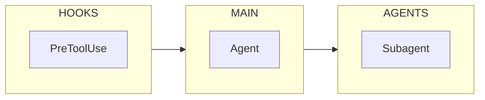
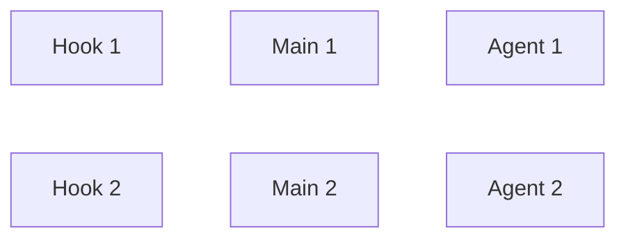
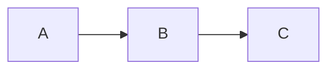

# Mermaid-Specific Techniques

## Advanced Layout Techniques for Multi-Layer Diagrams

For complex multi-layer systems (hooks/main/agents, pipelines with phases):

**1. Choose Orientation Based on Content Density**

| Scenario                                     | Direction | Rationale                        |
| -------------------------------------------- | --------- | -------------------------------- |
| Simple phases (few nodes per layer)          | `LR`      | Clean horizontal separation      |
| Complex layers (many nodes, detailed labels) | `TB`      | Vertical space for detail        |
| Deep hierarchies with cross-links            | `TB`      | Avoids cramped horizontal layout |

**LR "sandwich" layout** works well for simple phase diagrams:



**TB with side columns** works better for complex flows with detailed nodes - keeps labels readable and provides vertical room for many steps.

**2. Invisible Link Alignment Trick (`~~~`)**

Force vertical alignment between layers using invisible links:



This keeps top/middle/bottom nodes aligned for clean multi-layer layout.

**3. Shape Semantics for Concise Labels**

Use shapes to convey meaning, allowing shorter text:

- `([Start/End])` - Capsule for terminals
- `{Decision?}` - Diamond for gates
- `[Process]` - Rectangle for actions
- `("Subagent")` - Rounded for delegated work

Summarize verbose labels to 3-5 words; let shape convey additional context.

**4. Professional Styling with Stroke and Dashes**

```mermaid
classDef default stroke-width:2px
classDef hook stroke-dasharray: 5 5
linkStyle default stroke:#718096,stroke-width:1.5px
```

- `stroke-width:2px` creates button-like appearance for nodes
- `stroke-dasharray: 5 5` indicates listeners/interceptors (hooks, events)
- `linkStyle default` sets professional grey tone for all links

## Start with Init Block for Theme and Spacing

**CRITICAL**: Proper spacing is the #1 factor for readability. Default Mermaid spacing is cramped.

```mermaid
%%{init: {
  'theme': 'base',
  'themeVariables': {
    'primaryColor': '#1a1a2e',
    'primaryTextColor': '#eaeaea',
    'primaryBorderColor': '#4a4a6a',
    'lineColor': '#888',
    'fontSize': '14px'
  },
  'flowchart': {
    'nodeSpacing': 60,
    'rankSpacing': 70,
    'curve': 'basis',
    'padding': 20
  }
}}%%
```

**Spacing Configuration Strategy**:

| Layout              | nodeSpacing | rankSpacing | Rationale                                      |
| ------------------- | ----------- | ----------- | ---------------------------------------------- |
| **LR (left-right)** | 60-80       | 70-90       | Horizontal space for nodes, vertical for ranks |
| **TD (top-down)**   | 50-70       | 60-80       | Vertical space for nodes, horizontal for ranks |
| **Dense LR**        | 40-50       | 50-60       | For 6-8 node chains                            |
| **Spacious LR**     | 80-100      | 100+        | For complex systems (>15 nodes)                |

**Spacing guidelines - ALWAYS**:

- `nodeSpacing: minimum 50` - prevents cramped horizontal layout; increase to 70+ for clarity
- `rankSpacing: minimum 60` - gives breathing room between vertical ranks; increase to 80+ for multi-phase layouts
- `padding: 15-25` - buffer space around chart edge, prevents label cutoff
- For LR layouts: nodeSpacing affects horizontal distance, rankSpacing affects vertical
- For TD layouts: nodeSpacing affects vertical distance between nodes, rankSpacing affects horizontal spread

**Common spacing mistakes**:

- `nodeSpacing: 30` (Mermaid default) → ALWAYS increase to 50+
- `rankSpacing: 50` (Mermaid default) → ALWAYS increase to 60+
- No `padding` → Labels get clipped on edges, especially in Chrome
- Inconsistent spacing across subgraphs → Use same values everywhere

## Use classDef + class Over Many style Lines

Define once; apply everywhere:

```mermaid
classDef hook fill:#ffebee,stroke:#c62828,color:#b71c1c
classDef skill fill:#e3f2fd,stroke:#1565c0,color:#0d47a1

A[Start]:::start --> B[Process]:::skill
B --> C{Decision}:::decision
```

## Decision Shapes for Gates

```mermaid
C{Passed?} -->|Yes| D[Continue]
C -->|No| E[Handle Error]
```

## Edge Labels and Styles

```mermaid
A -->|primary path| B
A -.->|optional path| C
A ==>|emphasized| D
```

- **Solid** for mandatory paths
- **Dashed** (`-.->`) for optional paths
- Label key branches on the edge, not inside nodes

## Layout Direction

- `TD` (top-down) is good for process flows
- `LR` (left-right) for wide screens to shorten tall stacks



## Swimlanes via Subgraphs

```mermaid
subgraph INIT["Initialization"]
    A[Load config]
    B[Validate]
end

subgraph PROCESS["Processing"]
    C[Execute]
    D[Verify]
end

style INIT fill:#fff8e1,stroke:#ffe082
style PROCESS fill:#e8f5e9,stroke:#a5d6a7
```

## Interactivity with click

```mermaid
A[Component] --> B[Details]
click A "https://docs.example.com/component" "View docs"
```

## Maintainable IDs

- Use consistent naming: `PHASE_STEP`, `PHASE_DECISION`
- Avoid spaces in IDs
- Favor ASCII and underscores; hyphens can be tricky with some selectors
